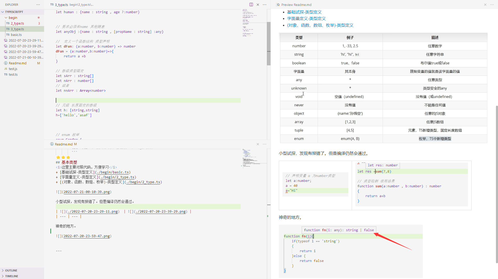
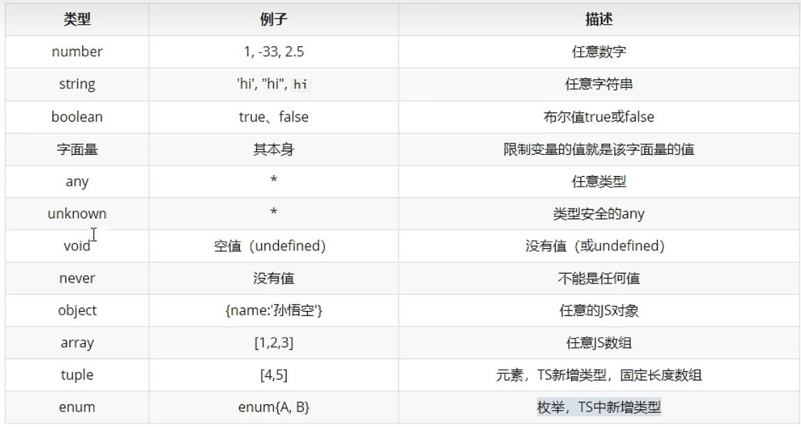
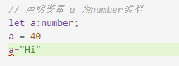
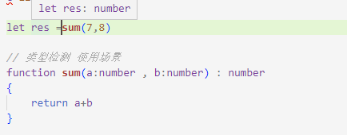
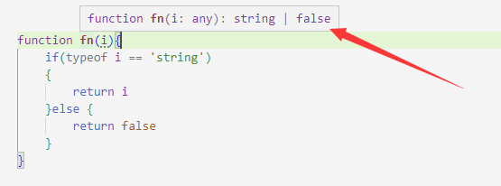

:1234: 学习中 [bilibili [李力超老师] 课程地址](https://www.bilibili.com/video/BV1Xy4y1v7S2?p=1)

⭐⭐⭐
## 概述
1. TypeScript 增加了什么？ 🔰
   1. 类型检测
   2. 支持Es新特性
   3. 丰富的配置项
   4. 添加ES不具备的新特性
2. TypeScript 环境
   1. 全局安装 **TypeScript**
        ```shell
        npm i typescript -g
        ```
   2. 创建一个ts文件
   3. 使用tsc对ts文件进行编译
        ```shell
        tsc *.ts  # 输入命令后 会生成一个 *.js 文件
        ```
⭐⭐⭐
## 基本类型 (p1-p5)
<i>这里主要对照代码，方便学习</i>

+ [基础试探-类型定义](./begin/basic.ts)
+ [字面量定义-类型定义](./begin/2_type.ts)
+ [(对象、函数、数组、枚举)-类型定义](./begin/2_type.ts)



小型试探，发现有报错了。但是编译仍然会通过。


神奇的地方。


 
---
